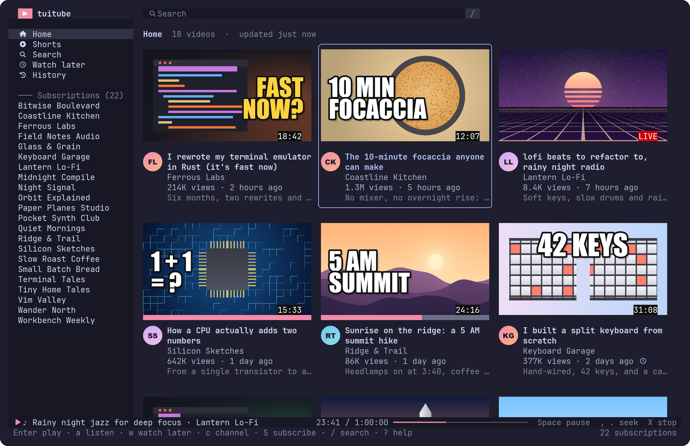

<div align="center">

# tuitube

**YouTube at the speed of your keyboard.**

A terminal YouTube client (TUI) that looks like YouTube: a sidebar, a grid of video cards with real thumbnails and channel photos, and mpv to play them.<br>
Arrow keys or vim keys. No Google account, no login, nothing sent to your watch history.

[](LICENSE)
[](https://www.rust-lang.org)
[](#built-with)

**[Get started](#get-started)** · **[Keys](#keys)** · **[Settings](#settings)** · **[Privacy](#privacy-and-security)**



<sub>The demo's made-up channels and videos: <code>tuitube --demo</code></sub>

</div>

> [!IMPORTANT]
> **For personal use only.** tuitube isn't made, endorsed or allowed by YouTube or Google. It plays videos through [yt-dlp](https://github.com/yt-dlp/yt-dlp) and [mpv](https://mpv.io), which YouTube's terms don't permit. It never logs in, so your Google account is never involved. See the [disclaimer](#disclaimer).

---

## Why tuitube

- **Looks like YouTube.** Home, Shorts, Search, Watch later and History in the sidebar, then your channels. Videos in a grid of cards: the thumbnail with its length, the watched part in red under it, the channel's photo beside the title, the channel, views and age, and the start of the description. The grid fills the window, down to the top of the next row.
- **Your subscriptions, without an account.** Import them once from Google Takeout. tuitube keeps them on your computer and gets their new videos from YouTube's public feeds, so there's no password, cookie or API key anywhere.
- **Arrows or vim, your choice.** `←↓↑→` and `h j k l` both move, `Enter` plays, `/` searches, `gg` / `G`, `Ctrl-d` / `Ctrl-u`, `PgUp` / `PgDn`. Left from the first column goes to the sidebar, `Tab` back. `?` lists every key.
- **Real thumbnails.** Full 1280×720 pictures in Ghostty, kitty, WezTerm and iTerm2 (sixel terminals too), with the channel's photo cut to a circle. Block-character previews in any other terminal.
- **Plays in mpv.** `Enter` opens the video in mpv's window, `a` plays the sound only, with a player bar in tuitube: `Space` pauses, `,` `.` skip 10 seconds, `<` `>` a minute, `X` stops. Videos carry on where you stopped.
- **Search YouTube.** `/` searches, and more results load as you scroll. `c` opens a video's channel, `S` subscribes to it (or unsubscribes, `u` undoes).
- **Watch later and History.** `w` saves a video for later, and what you play shows up in History, both kept only on your computer. `x` takes a video off either list.
- **Live and upcoming.** Live streams say **LIVE**, scheduled ones **UPCOMING**, and Shorts get a tab of their own instead of crowding Home.
- **Gentle on YouTube.** Feeds are fetched again only when they're more than 30 minutes old, and Home says when it was last updated (`R` fetches now). Lengths are looked up only for the cards on screen, 30 videos at a time, and tuitube backs off for an hour if YouTube asks it to slow down.
- **Make it yours.** Catppuccin, Tokyo Night, Dracula, Gruvbox, Nord and Rosé Pine themes (`T` goes round them), Nerd Font icons where your terminal has them, and card and sidebar widths to taste.
- **Private by design.** No account, no telemetry, no servers in between. Nothing goes into a YouTube watch history, and a video is only looked up when you play it, never when you move over it.

## Get started

tuitube needs three programs next to it, which it finds on your `PATH`:

| Program | What for |
| --- | --- |
| [yt-dlp](https://github.com/yt-dlp/yt-dlp) | Talks to YouTube: searches, channels, and what to play |
| [Deno](https://deno.com) | Runs the JavaScript yt-dlp needs for YouTube |
| [mpv](https://mpv.io) | Plays videos |

```sh
brew install yt-dlp deno mpv                               # macOS
sudo pacman -S yt-dlp deno mpv                             # Arch
winget install yt-dlp.yt-dlp DenoLand.Deno shinchiro.mpv   # Windows
```

Then build tuitube (Rust 1.90 or newer):

```sh
git clone https://github.com/erictran308/tuitube && cd tuitube
cargo build --release
./target/release/tuitube
```

### Bring your subscriptions

1. Open [takeout.google.com](https://takeout.google.com) and click **Deselect all**.
2. Tick **YouTube and YouTube Music**, click **All YouTube data included**, and keep only **subscriptions**.
3. Export, download the archive and unzip it.
4. In tuitube, press `I` and paste (or drop) the path to `subscriptions.csv`. Or, before starting it:

   ```sh
   tuitube --import ~/Downloads/Takeout/YouTube\ and\ YouTube\ Music/subscriptions/subscriptions.csv
   ```

Home fills up with your channels' newest videos within a minute. You can also start from nothing: search with `/` and press `S` on a video to subscribe to its channel.

### Check your setup

```sh
tuitube --check
```

It says where yt-dlp, Deno and mpv are, and how your terminal draws images. If thumbnails look blocky and channel photos are letters, see [Images and icons](#images-and-icons).

## Keys

The status bar shows the keys for where you are, and `?` lists them all.

| Key | Action |
| --- | --- |
| `←↓↑→` / `h j k l` | Move. Left from the first column goes to the sidebar |
| `Tab` / `Esc` | Sidebar ↔ videos |
| `gg` / `G`, `Home` / `End` | First / last |
| `PgUp` / `PgDn`, `Ctrl-u` / `Ctrl-d` | A page / half a page |
| `Enter` | Play in mpv; in the sidebar, open the view or channel |
| `a` | Listen: sound only, with the player bar in tuitube |
| `Space` | Pause or play |
| `,` / `.`, `<` / `>` | Back / ahead 10 seconds, 1 minute |
| `X` | Stop |
| `w` | Save to Watch later, or take it off |
| `x` | Take off Watch later or History; in the sidebar, unsubscribe |
| `c` | The video's channel |
| `S` / `u` | Subscribe to the video's channel or unsubscribe / undo unsubscribing |
| `/` or `s` | Search YouTube (`Enter` searches, `Esc` cancels, `Ctrl-u` clears) |
| `Backspace` / `Ctrl-o` | Back to the view before |
| `o` / `y` | Open the video in your browser / copy its link |
| `R` | Refresh: your subscriptions, the search or the channel |
| `I` | Import subscriptions from Google Takeout |
| `T` | Next theme |
| `q` | Quit |

## Settings

`settings.toml` in [your data folder](#your-data). Every line is optional:

```toml
theme = "mocha"        # latte, frappe, macchiato, mocha, tokyonight, dracula, gruvbox, nord, rose-pine
max_height = 1080      # tallest picture to play: 2160, 1440, 1080, 720, 480
refresh_minutes = 30   # how old a channel's feed may get before it's fetched again (15 at least)
history = true         # remember what you watch here, and where you stopped
descriptions = true    # the start of each description on its card
images = "auto"        # auto, kitty, sixel, iterm2 or blocks
icons = "auto"         # auto, nerd (Nerd Font icons) or plain
card_width = 34        # narrowest card, in columns
sidebar_width = 26

# Where the programs are, if they aren't on PATH:
# yt_dlp = "/opt/homebrew/bin/yt-dlp"
# mpv = "/opt/homebrew/bin/mpv"
# deno = "/opt/homebrew/bin/deno"
```

### Images and icons

tuitube asks your terminal how it draws images. Ghostty, kitty, WezTerm, iTerm2 and sixel terminals show real thumbnails and channel photos; others get block-character previews.

Inside tmux or another multiplexer, the question often doesn't reach the terminal. tmux needs `set -g allow-passthrough on`; for any multiplexer, `images = "kitty"` (or `TT_IMAGES=kitty`) tells tuitube to draw them anyway when your terminal is Ghostty or kitty.

Icons are Nerd Font icons in Ghostty, kitty and WezTerm, which have them built in, so they're all the same size. If one shows as a box, set `icons = "plain"`.

## Privacy and security

- **No account.** No login, no cookies, no API key: YouTube sees an anonymous visitor. tuitube never reads your browser's cookies.
- **No watch history.** Nothing tells YouTube what you watched. A video is looked up only when you play it, not when you move over it.
- **Your lists stay here.** Subscriptions, Watch later, History and settings are in one folder readable only by you. `history = false` stops History.
- **Locked-down helpers.** yt-dlp and mpv run with none of your own config files, scripts or plugins, a cleaned environment, and only ever URLs that tuitube built from checked video ids. tuitube controls mpv over a private channel no other program can reach.
- **Careful with what YouTube sends.** Titles, names and descriptions are cleaned of terminal escape codes before they're shown; images come only from YouTube's image servers, within size limits.

The research behind these choices is in [`reports/`](reports/YouTube%20terminal%20client.md). To report a problem, see [SECURITY.md](SECURITY.md).

## Your data

Everything is in one folder on your machine (`tuitube --help` prints its path):

| OS | Location |
| --- | --- |
| macOS | `~/Library/Application Support/tuitube` |
| Linux | `~/.local/share/tuitube` |
| Windows | `%LOCALAPPDATA%\tuitube` |

It holds `tuitube.db` (your subscriptions, the videos tuitube has seen, Watch later and History), `settings.toml`, and a cache of thumbnails and channel photos. Deleting it starts tuitube afresh.

| Variable | Use |
| --- | --- |
| `TT_DATA_DIR` | Keep the data folder somewhere else |
| `TT_YT_DLP`, `TT_MPV`, `TT_DENO` | Where those programs are, if not on `PATH` |
| `TT_IMAGES` | How images are drawn: `auto`, `kitty`, `sixel`, `iterm2` or `blocks` |
| `TT_ICONS` | Which icons: `auto`, `nerd` or `plain` |

## Development

```sh
cargo test                       # offline tests
cargo test -- --ignored live     # against YouTube (logged out) and the real mpv
cargo clippy --all-targets
TT_DATA_DIR=./.tuitube cargo run # a separate data folder for trying things
cargo run -- --demo              # made-up channels and videos, nothing fetched
```

`docs/hero.png` is one frame of `--demo`, drawn by `tools/hero.py` (its first lines say how).

Copy `.env.example` to `.env` for development settings. Only development builds read `.env`: an installed tuitube ignores it, so a `.env` in a folder you cloned can't change which programs it runs.

## Built with

- [yt-dlp](https://github.com/yt-dlp/yt-dlp) with [Deno](https://deno.com), and [mpv](https://mpv.io), run as separate programs
- [ratatui](https://ratatui.rs) and [ratatui-image](https://github.com/benjajaja/ratatui-image)
- [rusqlite](https://github.com/rusqlite/rusqlite), [reqwest](https://github.com/seanmonstar/reqwest) with rustls, and [quick-xml](https://github.com/tafia/quick-xml)
- The same UI groundwork, themes and safety rules as [tuigram](https://github.com/erictran308/tuigram) and [tuimeta](https://github.com/erictran308/tuimeta)
- Colors from [Catppuccin](https://catppuccin.com), [Tokyo Night](https://github.com/folke/tokyonight.nvim), [Dracula](https://draculatheme.com), [Gruvbox](https://github.com/morhetz/gruvbox), [Nord](https://www.nordtheme.com) and [Rosé Pine](https://rosepinetheme.com)

## Disclaimer

tuitube is an unofficial, independent hobby project. It is **not** affiliated with, endorsed by, sponsored by, or connected to Google LLC or YouTube in any way. "YouTube" and "Google" are trademarks of Google LLC, used here only to say what tuitube talks to.

Playing YouTube videos outside YouTube's own player breaks YouTube's terms of service. tuitube never logs in, but YouTube may still slow down or block requests from your network. **You use tuitube entirely at your own risk**, and you are responsible for complying with the laws and terms that apply to you.

The software is provided "as is", without warranty of any kind, express or implied. To the fullest extent permitted by law, the authors and contributors are **not liable** for any claim, damages or other liability arising from the software or its use. See the [MIT license](LICENSE) for the full terms.

For personal use only: do not use tuitube to download or redistribute videos, for automation, scraping, or any commercial purpose.

## License

[MIT](LICENSE). yt-dlp, Deno and mpv are separate programs under their own licenses; tuitube only starts them.
